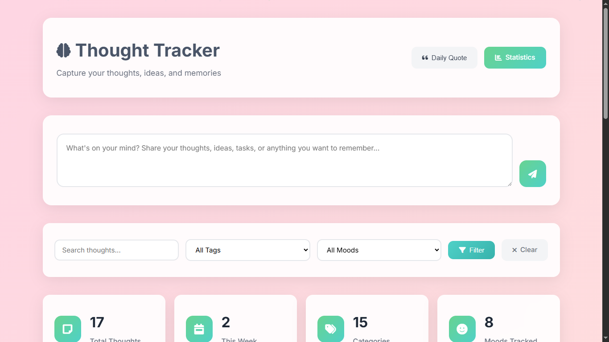

Sure! Here's a **reduced**, **professional**, and **tech-including** version of your `README.md` — clean, clear, and GitHub-ready 👇

---

```markdown
# 🧠 Thought Tracker

**Thought Tracker** is a smart, web-based journal built with **Flask**, **HTML**, **CSS**, and **JavaScript**. It helps users log their thoughts, automatically tags entries based on content, tracks emotional tone with mood indicators, and provides insights through visual analytics.

---

## 🚀 Features

- 🏷️ **Auto-Tagging** — Categorizes entries based on keywords
- 😊 **Mood Detection** — Converts emotional tone into emoji
- 🔍 **Search & Filters** — Filter by tag, mood, or keywords
- ❤️ **Like System** — React to your favorite thoughts
- 📊 **Analytics Dashboard** — Visualize your mood, tags, and activity
- ✨ **Responsive UI** — Modern design with glassmorphism and animations

---

## 🛠️ Tech Stack

### 💻 Backend
- **Python 3.7+**
- **Flask** – Web framework for routing and rendering
- **Jinja2** – Templating engine
- **JSON** – Lightweight local storage

### 🧠 NLP & Intelligence
- **Regex-based NLP** – Custom keyword tagging and mood detection
- **Sentiment mapping** – Mood indicators via rule-based keyword matching
- **Category classification** – Context-aware auto-tagging engine

### 🎨 Frontend
- **HTML5 & CSS3** – Responsive UI design with glassmorphism
- **JavaScript (Vanilla)** – Form validation, modals, filters, keyboard shortcuts
- **Chart.js** – Visual analytics (tag/mood/daily stats)
- **Font Awesome & Google Fonts** – Icons and typography

### ⚙️ Dev & Deployment
- **Render** (Optional) – Free Python web hosting
- **pip** – Dependency management

---

## 📂 Project Structure

```

thought-tracker/
├── app.py                 # Main Flask backend
├── data.json              # Thought data (local JSON)
├── requirements.txt       # Python dependencies
├── templates/             # HTML templates
├── static/                # CSS & JS assets
└── README.md              # Project documentation

````
---

## 📸 Preview



---

## 👤 Author

**Created by**: Anika K
**GitHub**: [https://github.com/a_k_0204](https://github.com/a_k_0204)

---

## 🧘 Quote

> “The thoughts we choose to think are the tools we use to paint the canvas of our lives.” – *Louise Hay*

```
